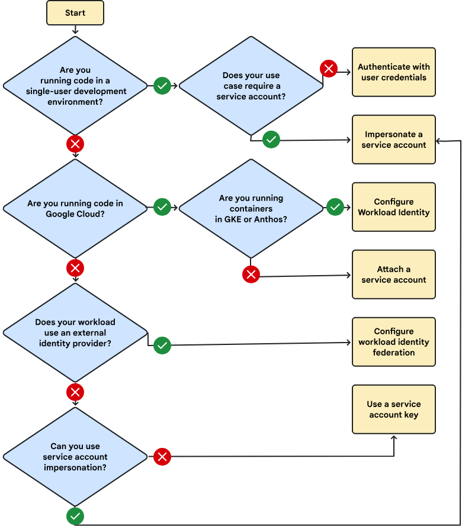
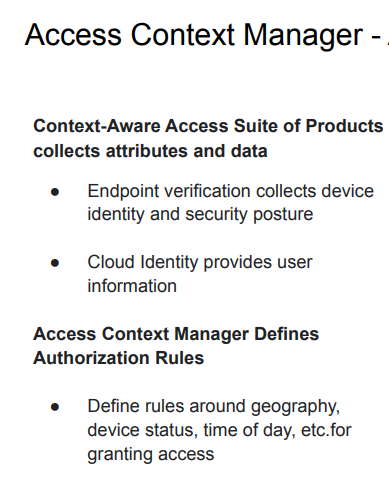
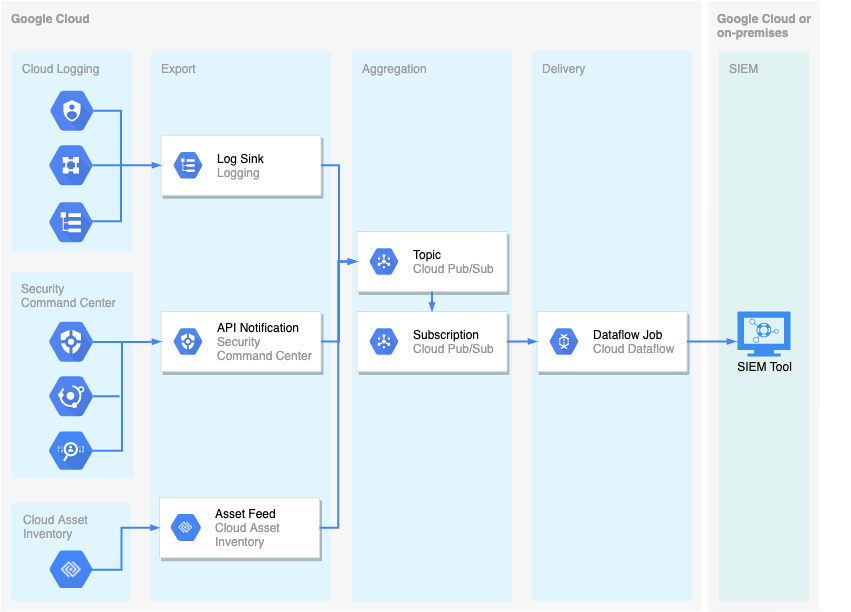
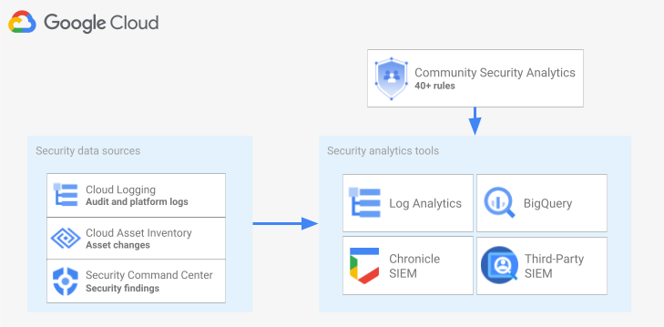
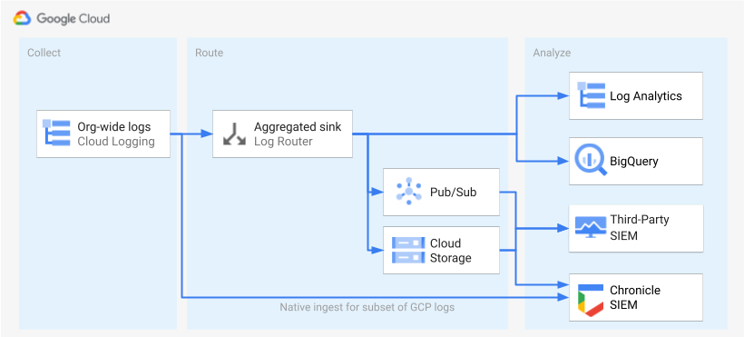

# Google Cloud PCSE Exam Study Guide

## 1. Identity Management

### Workforce Identity Federation
For users (humans) to connect to GCP, leveraging federated identity solutions allows seamless integration. Best practice involves using Google Cloud Directory Sync (GCDS) for synchronizing users' external accounts with Cloud Identity. This allows organizations to manage identities centrally while using Google Cloud resources.

**Scenario:** An enterprise uses Microsoft Active Directory for identity management. By setting up Workforce Identity Federation, the IT department can allow employees to use their existing AD credentials to access Google Cloud resources without creating separate Google accounts for each user.

### Workload Identity Federation
This feature is used for applications needing to connect to GCP without managing long-lived service account keys. Workload Identity Federation provides a secure and scalable way to grant external identities access to Google Cloud resources.

**Best Practice:** Use Workload Identity Federation to authenticate applications running in other clouds (AWS, Azure) or on-premises environments, thus avoiding the risks associated with managing service account keys.

### Google Cloud Directory Sync (GCDS)
GCDS synchronizes user accounts from external identity systems to Cloud Identity, ensuring users manage a single account externally. This helps maintain consistency and reduces administrative overhead.

**Best Practice:** Schedule regular synchronization intervals to ensure user data remains up-to-date across both Google Cloud and external identity systems.

### Identity plaftform vs Cloud Identity
Identity platform help implement IAM like functionality in custom made applications. It's different from Cloud Identity which is an Identity as a Service (IDaaS) solution that centrally manages users and groups. You can configure Cloud Identity to federate identities between Google and other identity providers, such as Active Directory and Microsoft Entra ID (formerly Azure AD)

### Identity-Aware Proxy (IAP)
IAP helps protect access to Google Cloud hosted resources and applications hosted on Google Cloud. AP lets you establish a central authorization layer for applications accessed by HTTPS, so you can use an application-level access control model instead of relying on network-level firewalls.

IAP also enables administrative access to VMs (SSH, RDP) without external IPs. This approach ensures that only authenticated and authorized personnel can access critical infrastructure without exposing it to the internet.

### Service Accounts
Avoid using Service Account (SA) keys whenever possible. Instead, use the following methods for enhanced security:

Always aim to use the most secure method available for your use case to minimize the risk of key exposure and misuse.

*It is best practice to disable a service account before deleting, If a service account is deleted, its role bindings are not instantly eliminated*

## 2. Organization Hierarchy and Policies

### Organization Policies
Organization policies allow administrators to manage settings at a high level across multiple projects. This hierarchical management ensures consistent policy enforcement and simplifies governance.

### Access Context
User + Device + Context forms the new security perimeter. Implementing a security perimeter involves defining access contexts and security policies that consider user identity, device status, and other contextual information.

Use Access Context Manager to define detailed access policies that include conditions based on user attributes, device compliance, and network location.

## 3. Tagging vs Labeling vs Network tags

### Tags
Tags (label V2) are used in policy (Org and IAM). Tags help organize resources and enforce security policies consistently.

### Network Tags
Used for traffic control, network tags allow administrators to apply firewall rules and routing policies to specific resources based on their tags.

### Labels
Labels are key-value pairs attached to resources for billing and organizational purposes. Labels help categorize and track resource usage for cost management and reporting.

## 4. Encryption and Key Management

### Customer Managed Encryption Keys (CMEK)
- **Cloud KMS**: helps customers create and manage their keys.
- **External Key Manager (EKM)**: Cloud EKM leverages existing EKM for key management, connecting via the internet or VPC.
- **Cloud HSM**: Provides tamper-resistant hardware modules for cryptographic operations.

**Best Practice:** Regularly rotate encryption keys and use key versioning to enhance security.

### Customer Supplied Encryption Keys (CSEK)
- **Raw CSEK**: Key is provided directly in an API call.
- **Public Key Wrapped CSEK**: Key is encrypted with a Google-provided public key certificate.

### Confidential Computing
Confidential Computing protects data during processing by using hardware-based Trusted Execution Environments (TEEs), ensuring data remains secure even when being processed.

### Shielded VMs
Shielded VMs protect the integrity of the virtual machine environment by using secure boot, virtual trusted platform module (vTPM), and integrity monitoring features.

## 5. Logging and SIEM

### Chronicle
Chronicle is a cloud-native SIEM offering advantages over legacy SIEMs, such as scalability and fixed pricing. It ingests and analyzes large volumes of security data to identify threats.

### Security Log Analytics
**Log routing**: Efficient log management and routing. Logs can be routed to different destinations, like BigQuery or Cloud Storage, for analysis and long-term storage.

## 6. Security Practices and Tools

### VPC Service Controls
VPC Service Controls constrain traffic within VPC SC perimeter without using the public internet. This enhances data security by creating security perimeters around Google Cloud resources.

### Access Context Manager
Access Context Manager defines rules around geography, device status, time of day, etc., for granting access. It helps enforce granular access policies based on user context.

### Data Loss Prevention (DLP)

Implement DLP policies to automatically scan and protect sensitive data across your Google Cloud environment.

The de-identification techniques that Sensitive Data Protection supports fall into the following general categories:

- [Redaction](https://cloud.google.com/sensitive-data-protection/docs/transformations-reference#redaction): Deletes all or part of a detected sensitive value.
- [Replacement](https://cloud.google.com/sensitive-data-protection/docs/transformations-reference#replacement): Replaces a detected sensitive value with a specified surrogate value.
- [Masking](https://cloud.google.com/sensitive-data-protection/docs/transformations-reference#masking): Replaces a number of characters of a sensitive value with a specified surrogate character, such as a hash (#) or asterisk (*).
- [Crypto-based tokenization](https://cloud.google.com/sensitive-data-protection/docs/transformations-reference#crypto): (or pseudonymisation) Encrypts the original sensitive data value using a cryptographic key. Sensitive Data Protection supports several types of tokenization, including transformations that can be reversed, or "re-identified." ⇒ is used when we need to deidentify data but still need them for ops purposes
- [Bucketing](https://cloud.google.com/sensitive-data-protection/docs/transformations-reference#bucketing): "Generalizes" a sensitive value by replacing it with a range of values. (For example, replacing a specific age with an age range, or temperatures with ranges corresponding to "Hot," "Medium," and "Cold.")
- [Date shifting](https://cloud.google.com/sensitive-data-protection/docs/transformations-reference#date_shift): Shifts sensitive date values by a random amount of time.
- [Time extraction](https://cloud.google.com/sensitive-data-protection/docs/transformations-reference#time-extract): Extracts or preserves specified portions of date and time values.

*Specific cases*
- **Reversibility**: Deterministic encryption can be reversed.
- **Cloud Data Loss Prevention with cryptographic hashing**: Ensures data cannot be reversed back to its original form, critical for anonymizing sensitive information like PHI.

### Policy Intelligence
- **IAM Recommender**: Optimizes access control policies using AI to suggest least privilege access recommendations.
- **Policy Analyzer**: Identifies potential security risks in IAM policies by analyzing permissions and usage patterns.
- **Policy Troubleshooter**: Helps troubleshoot IAM permissions by simulating access scenarios and identifying permission issues.

### Cloud Router
Cloud Router exchanges routes between your VPC and on-premises network via BGP. It supports both regional and global dynamic routing options, enabling efficient and scalable network connectivity.

it is a key component when creating a Google Cloud-based VPN

### Private Google Access

Private Google Access enables to reach Google APIs and services securely over the internal network.
Private Google Access is enabled on a subnet-by-subnet basis; this setting is available to you under the VPC subnet.

### Private Service Connect (PSC) vs Private Service Access (PSA)

- **Private Service Access (PSA)** uses VPC Peering, so considerations such as non-overlapping address spaces, quotas, and limits apply. 
- **Private Service Connect (PSC)** does not use VPC Peering, thus afreeing from those specific considerations.

### Shared VPC & VPC Service connect
Ensure the Shared VPC network host is in the same service perimeter as the projects connected to the network. Shared VPC allows multiple projects to share a common VPC network, facilitating centralized network management and security.

Ensure that the Shared VPC network host is in the same service perimeter as the projects connected to the network. [learn more](https://cloud.google.com/vpc-service-controls/docs/troubleshooting) 

## 10. Compliance and Governance

### Cloud Security Command Center (Cloud SCC)
Cloud SCC provides visibility into your security posture, helping you identify and mitigate risks across your Google Cloud environment.

### Cloud Audit Logs
Cloud Audit Logs provide a record of activities in your Google Cloud environment, helping you track changes and ensure accountability.

